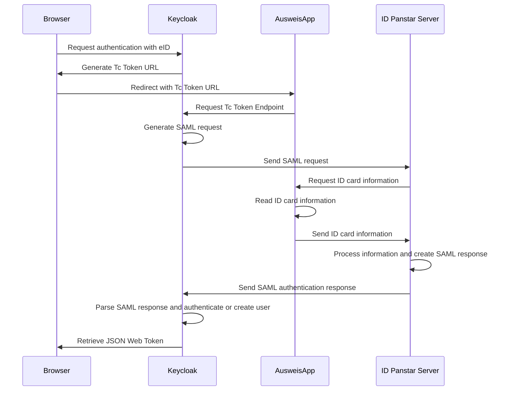

# eID Identity Provider for Keycloak  
     

  

This plugin enables registering and authenticating users via the German ID card in Keycloak. The actual checking of the ID card is not done in Keycloak, but in a so-called eID server. If you follow the guide below, we connect to the Governikus test server that is publicly available. If you would use this plugin in production, you would need your own Governikus server. The plugin heavily relies on the Governikus SDK, which is also available open-source on [OpenCode](https://gitlab.opencode.de/governikus/id-panstar-sdk.git).

You can also see a demo of how it works and why it's important in our [case study on eID](https://l21s.de/case-studies/keycloak-elektronischer-personalausweis-eid). 

## Known limitations
Users are authenticated with the `restrictedID` which is assigned to exactly one ID card. 
The `restrictedID` changes when a user gets a new ID card. Currently, there is no solution implemented to update a user account in this case.  

:warning: This plugin is not considered production ready, but should rather show that eID authentication with Keycloak is possible. If you want to use this in production, feel free to reach out to [@schmitzhermes](https://github.com/schmitzhermes) directly or book a meeting on our [L21s website](https://l21s.de/).

## Installation guide
### 1) Run Keycloak with the eID Provider
Use the following commands to set up Keycloak with the eID identity provider plugin in a Docker container.  
  
`git clone git@github.com:L21s/keycloak-eid-identity-provider.git`  
`cd keycloak-eid-identity-provider`  
`mvn clean package -P dev`  
`docker-compose up`

If everything ran correctly, you should see the following line in your docker log:
```
[...]
keycloak-1  | 2024-10-11 08:01:12,228 WARN  [org.keycloak.quarkus.runtime.KeycloakMain] (main) Running the server in development mode. DO NOT use this configuration in production.
config-1    | 2024-10-11T08:01:15.157Z  INFO 1 --- [           main] d.a.k.config.KeycloakConfigRunner        : keycloak-config-cli ran in 00:11.643.
config-1 exited with code 0
```

Then, you are already able to login to Keycloak via eID. The auto-configuration is done automatically using the beautiful `keycloak-config-cli` tool, which is also [open-source](https://github.com/adorsys/keycloak-config-cli). The corresponding config file is [config/realm.yaml](config/realm.yaml)

Please look [here](config/config.md) if you want to know how to manually configure Keycloak.

### 2) Trust the Keycloak certificate in your browser
Keycloak uses a self-signed certificate and your browser will most likely prevent the frontend application in step 4 from redirecting to keycloak. Thus, you need to open Keycloak before and trust the self-signed certificate. 

Open https://localhost:8443/realms/master/.well-known/openid-configuration in the browser of your choice and accept the self-signed certificate. You can close the tab now as you won't need it again.

### 3) Configure the AusweisApp for test purposes
> [!NOTE]
> This is only necessary in a test setup. In production setups, of course, users do not need to follow these steps.

For using the Proof-of-Concept, the AusweisApp ([Download](https://www.ausweisapp.bund.de/download)) must be running on the same machine as Keycloak. In addition, it must be configured to mock an ID card.  

To mock an ID card, the developer mode must be activated:
- Open the AusweisApp
- click on "Help"
- click on "Information"
- click ten times on the version number

Now, the developer mode is activated and you will see "developer settings" when you click on "settings". Here you can enable the "internal card simulator".  

This is also described in [this official document](https://www.ausweisapp.bund.de/fileadmin/user_upload/AusweisApp-2.2.0-NetInstallation_Integration.pdf), but unfortunately only in German.  

### 4) Login with (simulated) ID card
Open http://localhost:4200.  
You will be redirected to Keycloak, where you can choose "eid" as a login method (below the username / password fields). You will then be redirected to the AusweisApp and the eID flow starts.  

> [!NOTE]
> Please note that if you activated the developer mode in the AusweisApp, the button you need to click to be redirected to the frontend when the authentication is done is sort of hidden behind the developer mode overlay.

## Detailed explanation of authentication flow

More technical details can be found [here](https://www.bsi.bund.de/DE/Themen/Unternehmen-und-Organisationen/Standards-und-Zertifizierung/Technische-Richtlinien/TR-nach-Thema-sortiert/tr03130/tr-03130.html).

## Contributing
### Code style
The [Google Java Style](https://google.github.io/styleguide/javaguide.html) is used for this project. There are two ways to format your code accordingly:
1. Download the respective XML file from the [Google Style Guide](https://github.com/google/styleguide) repository and follow [these](https://github.com/google/google-java-format?tab=readme-ov-file#using-the-formatter) instructions to format the code with your IDE.
2. Run `mvn com.spotify.fmt:fmt-maven-plugin:format` from the terminal in the repository's directory.  

If the code is not formatted correctly, the build will fail.

