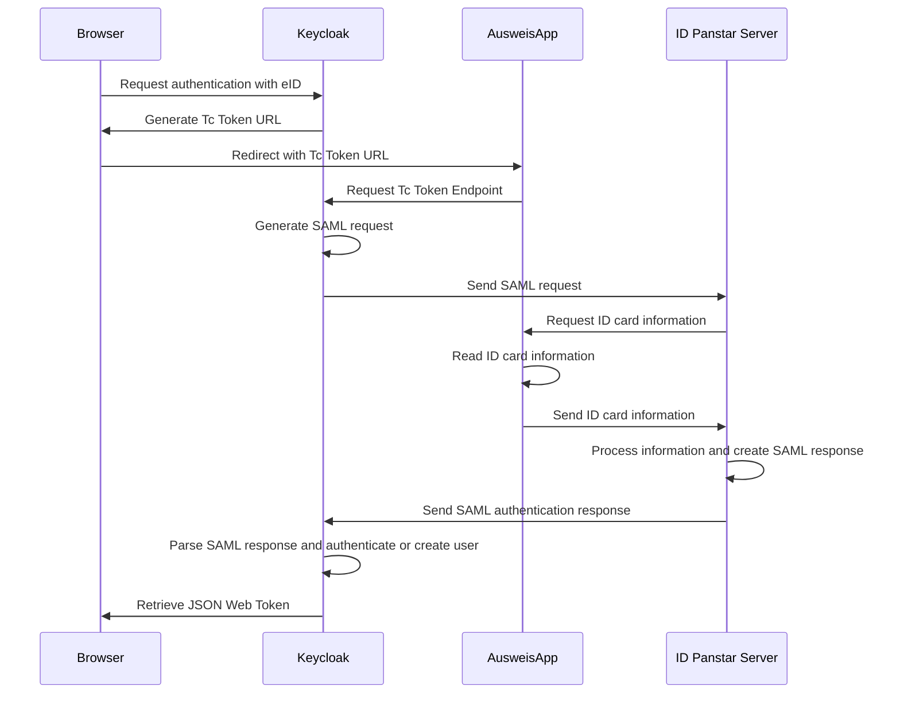

# eID Identity Provider for Keycloak  
   

  

This plugin delivers the eID identity provider which enables user creation and authentication with the German ID card.

## Known limitations
Users are authenticated with the `restrictedID` which is assigned to exactly one ID card. 
The `restrictedID` changes when a user gets a new ID card. Currently, there is no solution implemented to update a user account in this case.

## Installation guide
### Requirements
For the authentication process, Keycloak communicates with the [Governikus ID Panstar](https://www.governikus.de/en/loesungen/produkte/id-panstar/) server and the locally running [AusweisApp](https://github.com/Governikus/AusweisApp).
It is necessary to have access to both, the respective Governikus ID Panstar Server URL and the keys and certificates that secure the communication with the server.
To get you started as fast as possible, we deliver an out-of-the-box solution that uses publicly available keys and certificates.
This must be understood as a Proof-of-Concept and is NOT production ready.

### Quickstart with Docker
Use the following commands to set up Keycloak with the eID identity provider plugin in a Docker container.  
  
`git clone git@github.com:L21s/keycloak-eid-identity-provider.git`  
`cd keycloak-eid-identity-provider`  
`mvn clean package -P dev`  
`docker-compose up`

### Configuration
Go to `https://localhost:8443` and log in to the Keycloak Admin UI with `admin` as Username and Password, go to identity providers, and select eID.
For a fully functional eID identity provider, Client Id and Client Secret are not necessary but the current Keycloak implementation requires dummy values. More information are provided [here](https://github.com/keycloak/keycloak/issues/21891).
ID Panstar Server URL `https://dev.id.governikus-eid.de/gov_autent/async` and SAML Request Entity Base URL `https://localhost:8443` must be configured.
In addition, the required keys and certificates are stored at `src/main/resources/keys`.
They are named after their respective configuration purposes and the order in which they must be selected.  

### Setup without Docker
Follow these steps to run Keycloak including the eID identity provider without Docker:
1. Download Keycloak [here](https://github.com/keycloak/keycloak/releases). 
2. Go to this project's directory and run `mvn clean package -P dev`.
3. Copy the content of this project's `target/deploy` directory to the downloaded Keycloak's `providers` directory as described [here](https://www.keycloak.org/docs/latest/server_development/index.html#registering-provider-implementations).
4. Open the keycloak directory and use `bin/kc.sh build` to build the project including the eID identity provider.
5. Run `bin/kc.sh start-dev --https-key-store-file=<path-to-keycloak-eid-identity-provider-repository>/src/main/resources/keys/tls-ssl-commcert.p12 --https-key-store-password=123456` to start Keycloak.
6. Go to `https://localhost:8443` and manually create a user to add and configure an eID identity provider.

If the eID identity provider plugin was registered successfully, `TcTokenEndpointFactory` and `EidIdentityProviderFactory` are detected and logged throughout the execution of the build and the run command.  

## Development

