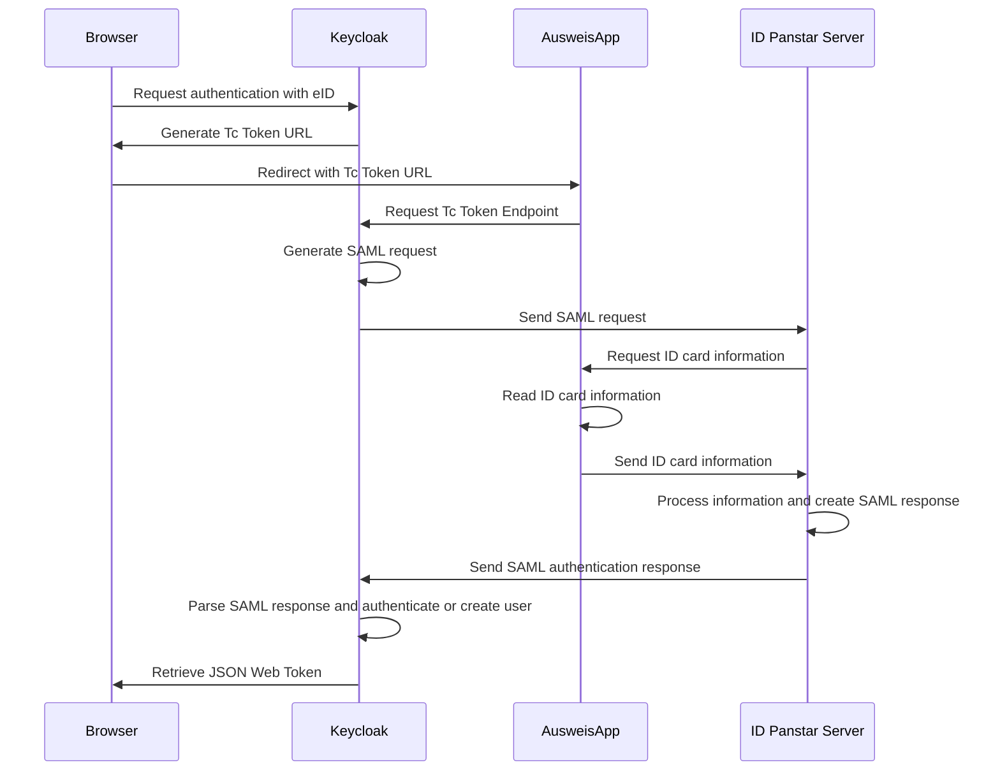

# eID Identity Provider for Keycloak  
     

  

This plugin enables registering and authenticating users via the German ID card in Keycloak. The actual checking of the ID card is not done in Keycloak, but in a so-called eID server. If you follow the guide below, we connect to the Governikus test server that is publicly available. If you would use this plugin in production, you would need your own eID-server.  

You can also see a demo of how it works and why it's important in our [case study on eID](https://l21s.de/case-studies/keycloak-elektronischer-personalausweis-eid). 

## Known limitations
Users are authenticated with the `restrictedID` which is assigned to exactly one ID card. 
The `restrictedID` changes when a user gets a new ID card. Currently, there is no solution implemented to update a user account in this case.  

:warning: This plugin is not considered production ready, but should rather show that eID authentication with Keycloak is possible. If you want to use this in production, feel free to reach out to [@schmitzhermes](https://github.com/schmitzhermes) directly or book a meeting on our [L21s website](https://l21s.de/).

## Installation guide

### 1) Run Keycloak with the eID Provider
Use the following commands to set up Keycloak with the eID identity provider plugin in a Docker container.  
  
`git clone git@github.com:L21s/keycloak-eid-identity-provider.git`  
`cd keycloak-eid-identity-provider`  
`mvn clean package -P dev`  
`docker-compose up`

If the eID identity provider plugin was registered successfully, `TcTokenEndpointFactory` and `EidIdentityProviderFactory` are detected and logged throughout the execution of the build and the run command.

### 2) Configure Keycloak to enable the eID provider
Follow these steps to configure the eID identity provider for using the Proof-of-Concept. 
1. Go to `https://localhost:8443` and log in to the Keycloak Admin UI with `admin` as Username and Password.
2. Go to identity providers and select eID.
3. Set dummy values for Client Id and Client Secret. They are not necessary for a functioning eID identity provider but are required by the current [Keycloak implementation](https://github.com/keycloak/keycloak/issues/21891).  
4. Set the ID Panstar Server URL to `https://dev.id.governikus-eid.de/gov_autent/async`. 
5. Set the SAML Request Entity Base URL to `https://localhost:8443`.
6. Set the keys and certificates stored at `src/main/resources/keys` in the order specified by their names.   

The final configuration looks like this.

### 3) Configure the AusweisApp for test purposes
> [!NOTE]
> This is only necessary in a test setup. In production setups, of course, users do not need to follow these steps.

For using the Proof-of-Concept, the AusweisApp must be running on the same machine as Keycloak. In addition, it must be configured to mock an ID card.
Therefore, the developer mode must be activated as described [here](https://www.ausweisapp.bund.de/ausweisapp2/help/1.20/en/Windows/settings-developer.html#aktivieren-des-entwicklermodus).
Afterward, go to Settings -> Developer options and activate the internal card simulator.

### 4) Login with (simulated) ID card
If you now login into Keycloak, you can choose "eid" as an identity provider in the login dialog. If you click on it, the AusweisApp will start and authenticate you. If you followed the guide, it will also authenticate you without actually presenting an ID card, as the AusweisApp is in development mode.  

:warning: If you try this on the Keycloak admin console you will end up in a blank page, because the person registering via eID does not have access to the Keycloak admin console (as they are no admins, of course). 

## Detailed explanation of authentication flow

More technical details can be found [here](https://www.bsi.bund.de/DE/Themen/Unternehmen-und-Organisationen/Standards-und-Zertifizierung/Technische-Richtlinien/TR-nach-Thema-sortiert/tr03130/tr-03130.html).

## Contributing
### Code style
The [Google Java Style](https://google.github.io/styleguide/javaguide.html) is used for this project. There are two ways to format your code accordingly:
1. Download the respective XML file from the [Google Style Guide](https://github.com/google/styleguide) repository and follow [these](https://github.com/google/google-java-format?tab=readme-ov-file#using-the-formatter) instructions to format the code with your IDE.
2. Run `mvn com.spotify.fmt:fmt-maven-plugin:format` from the terminal in the repository's directory.  

If the code is not formatted correctly, the build will fail.

